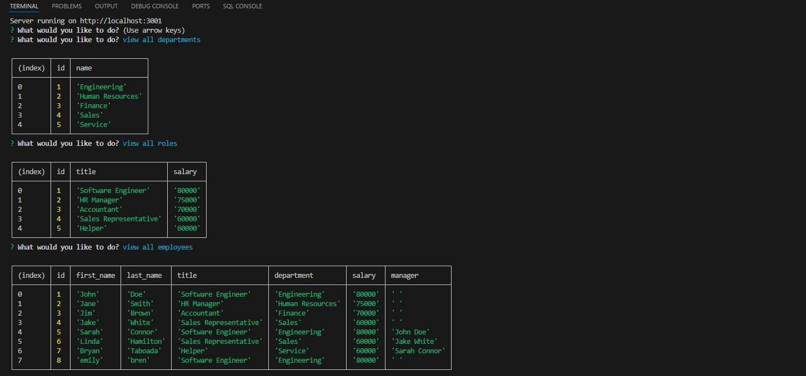

# Employee Tracker

## Description 
Creating a command line application that allows an employee to manage a company's employees, departments, and roles.  It gives a clear display of departments, roles, employees, titles, salaries, and managers.  

## Table of Contents
- [Installation](#installation)
- [Usage](#usage)
- [URL](#url)
- [Credits](#credits)
- [License](#license)
- [How to Contribute](#how-to-contribute)
- [Questions](#questions)

## Installation
To install this project, clone from github. (https://github.com/Taboada-B/Employee-Tracker.git). In order to start the application, the user must key in the following comand lines at the root one at a time. psql -U postgres, enter password user's password, \i db/schema.sql; , \i db/seeds.sql; , \q , npm i, node server.js.  After this, the 

## Usage
After the user installs the project, simply follow the commands to easily view , add, or update data as needed.  

## URL
NA

## Credits
Bryan Taboada
- https://github.com/Taboada-B
- b.taboada123@gmail.com

## License

This project is licensed under the MIT 
- see the following link for details: [MIT License](https://opensource.org/licenses/MIT)

## How to Contribute
1. Fork the repository
2. My github profile is: Taboada-B
3. Commit your changes (git commit -m 'Add some description')
4. Push to the branch (git push origin feature/fooBar)
5. Create a new Pull Request

## Questions

My email is: b.taboada123@gmail.com
